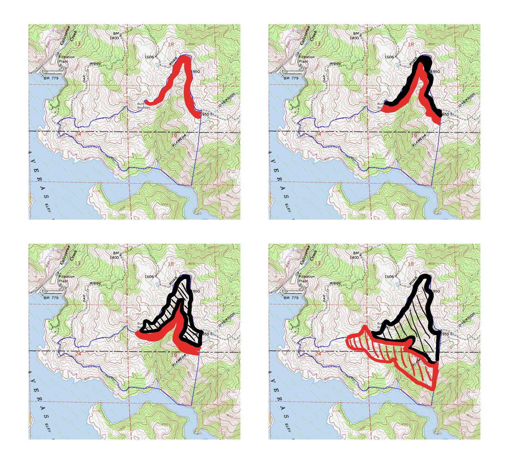

# SMeshSmokeValidation.jl

This Repository is part of the Final Project for Stanford's class on [Validation of Safety Critical Systems (AA228V/CS238V)](https://aa228v.stanford.edu/). The [SMesh project](https://smesh.info/) is a larger Stanford student team in collaboration between the [Climate and Energy Policy Program (CEPP) in the Woods Institute for the Environment](https://woods.stanford.edu/research/climate-and-energy-policy-program) and the [Stanford Radio Club](https://w6yx.stanford.edu/).

Project Team: Daniel Neamati and Evan Twarog 

## Project Goals
A Stanford student-led group ([SMesh](https://smesh.info/)) has developed a mesh network of smoke sensors that can be placed near the perimeter of prescribed burns to provide insights into air quality and fire behavior. However, placing these nodes is challenging as placement is constrained by topography, brush coverage, and difficult-to-predict mountain winds. Plus, the placements must occur days in advance of a burn, leading to a reliance on the expected burn pattern and the forecasted wind direction. This project aims to test and validate a smoke sensor sensor placement algorithm. The goal is to estimate the probability of "missing" the smoke plumes from these burns given $n$ nodes placed at positions $\{x_i\}_{1:n}$.

## System Specification
* **Minimum:** At least one SNode detects smoke ($S_i$ for SNode $i \in [1, n]$) within $t$ mins of the burn beginning. We can formalize this as $\lor_{i \in [1, n]} (\lozenge_{[0, t]} S_i)$.
* **Goal:** For any time interval $\Delta t$ until the end of the burn $T$, at least one SNode detects the smoke at least once in that time interval: $\land_{t \in [0, T]} \left( \lor_{i \in [1, n]} (\lozenge_{[t, t + \Delta t]} S_i) \right)$
* **Constraint:** All SNodes have a communication route ($R_i$) to the logger ($\square R_i, \forall i)$.

## Diagram: Smoke Monitoring for a Typical Prescribed Burn

Figure 1 highlights how firefighters manage a prescribed burn. Red areas are actively burning, whereas black are smoldering. Firefighters typically burn small swaths of land, working downhill to minimize the risk of losing control during a prescribed burn (ideally these are low-adrenaline events). For this reason, prescribed burns must be modeled differently than uncontrolled wildfire. Success for this project involves not only capturing smoke data, but ideally being able to reconstruct a representation of smoke behavior as it dispersed from the burn area. 
